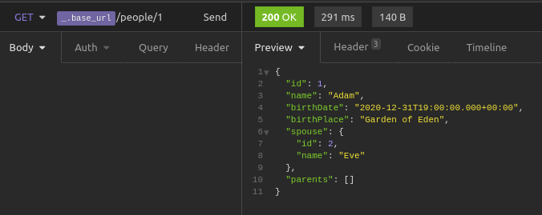
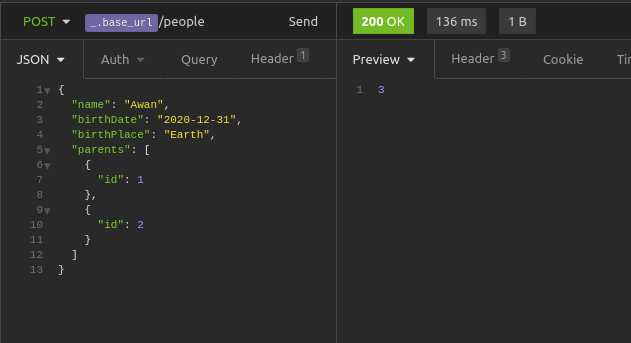
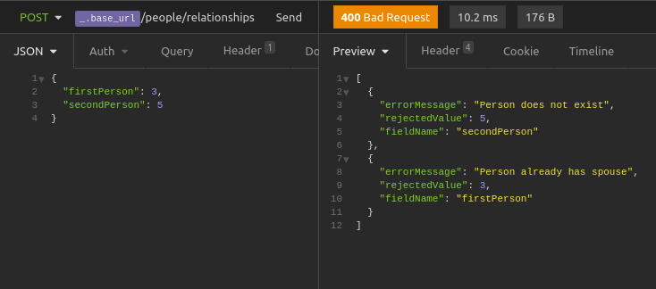

### Task
Design and implement a Spring Boot microservice with an API that maintains a database of people and their family relationships.
The database must contain initial records for Adam, Eve and their relationship (spouses).
The microservice must have at least the following endpoints and use JSON as the input/output data format:

Endpoint | Method | Description
--- | --- | ---
`/people` | **POST** | Add new person with given name, parents, birth date and birth place
`/people/{id}` | **GET** | Return a person with given ID
`/people/relationships` | **POST** | "Marriage": Add new marriage relationship between two people with given IDs

Expected results:
1. Java 8 or higher project with build configuration for Maven
2. Docker image with a microservice (see Maven jib plugin)
3. docker-compose configuration file that starts the microservice and a database
4. 70-80% unit test coverage for the logic that determines the relationship (JUnit 5, Jupiter engine).

### How to start
1. Clone this repository
2. Build and push a container image to a container registry by command:
```
mvn package "-Dimage=<MY IMAGE>"
```

3. Write down a container image in the `.env` file:
```
image=<MY IMAGE>
```

4. To start the microservice and a database use:
```
docker-compose up
```

### Examples of input and output


